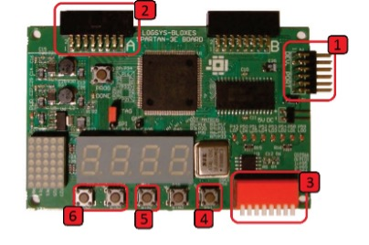
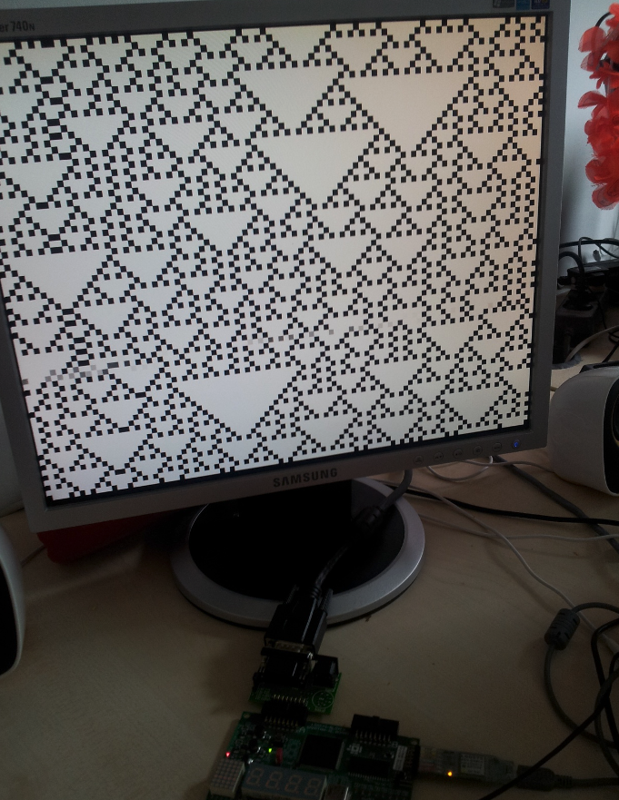

# cellular-automaton-verilog-demo

A simple cellular automaton on FPGA, displayed via VGA display, written in Verilog.

> University project from 2013. It was designed for a Labsys custom FPGA board with Xilinx Spartan3.

[https://en.wikipedia.org/wiki/Cellular_automaton](https://en.wikipedia.org/wiki/Cellular_automaton)

### Target Board

### In action

